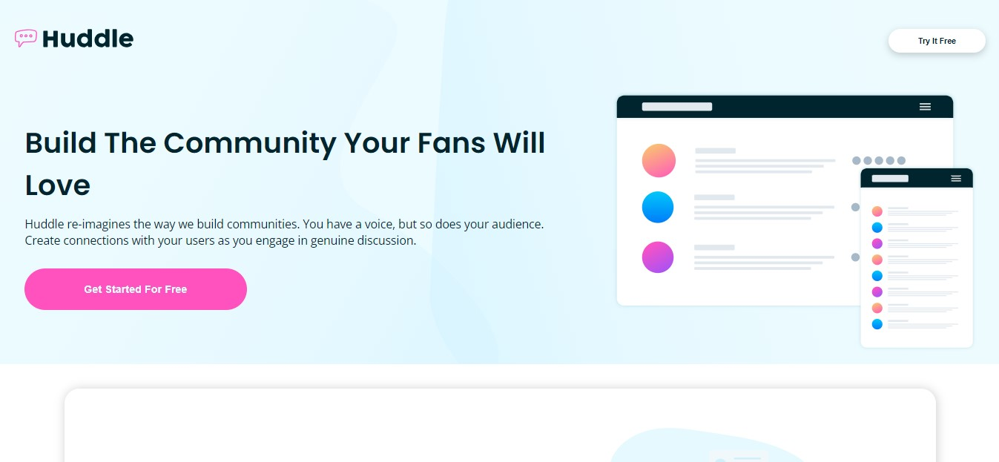

# Frontend Mentor - Huddle landing page with alternating feature blocks solution

Essa é minha solução para o [Página inicial do Huddle com desafio de blocos de recursos alternados no Frontend Mentor](https://www.frontendmentor.io/challenges/huddle-landing-page-with-alternating-feature-blocks-5ca5f5981e82137ec91a5100). Os desafios do Frontend Mentor lhe ajudam a aprimorar habilidades de codificação construindo projetos realistas.  

[Clique aqui](README.md) para retornar a versão em inglês.

## tabela de conteúdos

- [Overview](#overview)
  - [O desafio](#o-desafio)
  - [Screenshot](#screenshot)
  - [Links](#links)
- [Feito com](#feito-com)
- [Autor](#autor)

## Overview

### O desafio

Os usuários devem ser capazes de:

- Ver o layout ideal dependendo do tamanho da tela do dispositivo
- Ver os estados de foco para elementos interativos na página

### Screenshot

### Links

- Solution URL: [Solution](#)
- Live Site URL: [Live Site](#)

## Feito com

- HTML5 semântico
- HTML & CSS puro
- Propriedades personalizadas CSS
- Flexbox
- CSS Grid
- Media Query
- Mobile-first workflow

Feito dentro do tempo de
5 horas e 31 minutos

## Autor

- Frontend Mentor - [@Gabriel-H502](https://www.frontendmentor.io/profile/Gabriel-H502)
- FreeCodeCamp - [@Gabriel-H502](https://www.freecodecamp.org/Gabriel-H502) 
- GitHub - [Gabriel-H502](https://github.com/Gabriel-H502)
